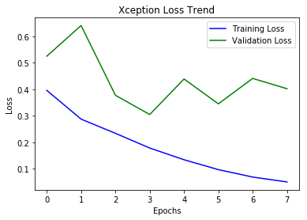

# Dogs vs. Cats

[A computation](https://www.kaggle.com/c/dogs-vs-cats-redux-kernels-edition) from Kaggle and [a graduation project](https://github.com/nd009/capstone/tree/master/dog_vs_cat) for machine learning engineer nanodegree on Udacity 

在 `./output/` 文件夹中为该项目的输出文件，其中：

* `Dogs_vs._Cats.html` 项目代码及文档
* `proposal.pdf` 开题报告
* `report.pdf` 项目报告

本项目使用 Python 在 Jupyter Notebook 环境下开发，并用到了如下的库：

```
import os
import random
import cv2
from matplotlib import pyplot
import numpy
from keras.models import Model
from keras.layers import Dense, GlobalAveragePooling2D
from keras.applications.xception import Xception
from IPython.display import SVG
from keras.utils.vis_utils import model_to_dot
from keras.optimizers import Nadam
from keras.callbacks import EarlyStopping
```

其中, `cv2` 来自 OpenCV, 用于图片的读取、缩放等操作; `keras` 用于 CNN 深度学习模型的构建和训练。

用于训练 CNN 的[数据集](https://www.kaggle.com/c/dogs-vs-cats-redux-kernels-edition/data)来自[猫狗大战](https://www.kaggle.com/c/dogs-vs-cats-redux-kernels-edition)

在 AWS p2.xlarge 实例中（输出层微调）运行结果如下：

```
Train on 15000 samples, validate on 5000 samples
Epoch 1/10
15000/15000 [==============================] - 332s - loss: 0.1624 - acc: 0.9503 - val_loss: 0.8713 - val_acc: 0.7998
Epoch 2/10
15000/15000 [==============================] - 334s - loss: 0.0673 - acc: 0.9759 - val_loss: 1.1316 - val_acc: 0.7266
Epoch 3/10
15000/15000 [==============================] - 334s - loss: 0.0641 - acc: 0.9761 - val_loss: 0.0521 - val_acc: 0.9800
Epoch 4/10
15000/15000 [==============================] - 334s - loss: 0.0500 - acc: 0.9805 - val_loss: 0.0646 - val_acc: 0.9758
Epoch 5/10
15000/15000 [==============================] - 334s - loss: 0.0426 - acc: 0.9833 - val_loss: 0.0731 - val_acc: 0.9740
Epoch 6/10
15000/15000 [==============================] - 334s - loss: 0.0389 - acc: 0.9869 - val_loss: 0.0786 - val_acc: 0.9704
Epoch 7/10
15000/15000 [==============================] - 334s - loss: 0.0328 - acc: 0.9877 - val_loss: 0.0713 - val_acc: 0.9758
```



训练集与验证集均趋于稳定且非常接近，模型达到稳定。
