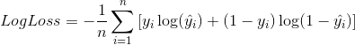
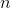
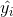
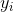
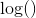
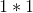

# 机器学习工程师纳米学位

## 毕业项目开题报告

aesne  
2017年8月27日

## 猫狗大战

### 项目背景

准确而快速地识别猫或者是狗的图片，对人类而言是很容易的，但是对与计算机来讲并不那么简单。困难的原因在于，计算机对于图像信息的处理是以像素为单位的，当拍摄同一物体的角度、亮度发生变化，甚至是物体被遮挡时，产生的图片像素可能完全不同，但毫无疑问都是同一物体的图像。如何快速准确地识别物体，依然是计算机视觉领域几十年来的重要挑战，也是人工智能的重要分支。

我在众多项目中选择了[猫狗大战](https://www.kaggle.com/c/dogs-vs-cats-redux-kernels-edition)，一方面是因为它涉及到了很多计算机视觉领域的基本问题，而机器视觉是人工智能应用中的重要分支；另一方面，它是Kaggle的经典项目，具有一定的知名度，可作为项目经历写在简历中。

### 问题描述

该项目的主要解决的问题是：输入一张猫或者狗的图片，识别出图片的内容，并且多次输入下，识别的准确率应达到一个合理的水平。

对于这类很难界定特征的分类问题，目前采用[深度学习](https://en.wikipedia.org/wiki/Deep_learning)效果比较好，特别的在图像识别领域，受生物视觉原理启发的[卷积神经网络](https://en.wikipedia.org/wiki/Convolutional_neural_network)方法比较适合处理此类问题。

### 数据输入

[用于训练和测试的数据集](https://www.kaggle.com/c/dogs-vs-cats-redux-kernels-edition/data)由Kaggle提供，来自[Petfinder.com](https://www.petfinder.com/)提供的一部分数据。Petfinder.com是世界上最大的专门为无家可归的宠物寻找家园的网站，提供了超过三百万只猫和狗的图像，由美国各地数千个动物收容所的人工分类。

训练集文件夹包含25,000张狗和猫的图像，该文件夹中的每个图像都有标签作为文件名的一部分。测试集文件夹包含12,500个图像，根据数字标识命名。对于测试集中的每个图像，需要预测图像是狗的概率（1表示是狗，0表示是猫）。

### 解决办法

利用训练集中的一部分数据，对一些知名的CNN模型进行训练，另一部分数据用于评价各模型表现，选出最优的模型，其模型及参数为该问题的解决办法。最终用测试集进行测试。

### 评估指标

采用对数损失函数来衡量模型表现：

其中，
- 为测试集中的图片数量
- 为预测图片内容为狗的概率
- , 图片内容如果是狗值为1, 如果是猫则值为0
- 为自然(底为的)对数

对数损失函数值越小越好。

### 基准模型

* [LeNet](http://yann.lecun.com/exdb/publis/pdf/lecun-01a.pdf)
  - 卷积神经网络使用3层架构：卷积（提取图像空间特征）、下采样（使用了图像平均稀疏性）、非线性激活函数（tanh或者sigmoid函数）
  - 多层神经网络（MLP）作为最后的分类器
  - 层之间使用稀疏连接矩阵，以避免大的计算成本
  
* [AlexNet](https://papers.nips.cc/paper/4824-imagenet-classification-with-deep-convolutional-neural-networks.pdf)
  - 数据增强（水平翻转，随机裁剪、平移变换，颜色、光照变换）
  - 使用ReLU函数作为激活函数，降低了Sigmoid类函数的计算量
  - 利用dropout技术在训练期间选择性地剪掉某些神经元，避免模型过度拟合
  - 利用LRN临近数据做归一化，进一步减少错误率
  - 引入pooling池化技术
  - 利用GPU并行计算显著减少训练时间
  
* [VGGNet](https://arxiv.org/abs/1409.1556)
  - 使用小卷积核减少运算量
  - 采用更多层的卷积
  
* [GoogLeNet](https://arxiv.org/abs/1409.4842)
  - 引入Inception，卷积核用于降维，多个卷积核形成的网络作为整体网络中的一层
  
* [ResNet](https://arxiv.org/abs/1512.03385)
  - 引入残差网络
  
* [Inception v3](https://arxiv.org/abs/1512.00567)
* [Inception v4](https://arxiv.org/abs/1602.07261)
* [Xception](https://arxiv.org/abs/1610.02357)
* [ResNeXt](https://arxiv.org/abs/1611.05431)

>[#Deep Learning回顾#之LeNet、AlexNet、GoogLeNet、VGG、ResNet](https://zhuanlan.zhihu.com/p/22094600)

>[CNN那么多的网络有什么区别吗？如何对CNN网络进行修改？](https://www.zhihu.com/question/53727257)ZOMI的回答

### 设计大纲

1. 正确读取训练集的内容和标签
2. 将训练集分为训练集和验证集
3. 实现CNN模型
4. 利用训练集训练模型，并用验证集评估模型
5. 选出最佳模型，利用测试集测试正确率
