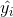

# 机器学习工程师纳米学位

## 毕业项目报告

aesne  
2017年8月27日

## 猫狗大战 

### I. 问题的定义

#### 项目概述

该项目的主要问题是构建一个深度学习模型来识别一张图片里是猫还是狗。

该问题属于机器视觉领域中的识别问题。目前比较好的解决方法是根据生物视觉原理的卷积神经网络方法。1998年 LeNet 模型最早引入了卷积神经网络的方法；2012年 AlexNet 使用ReLU函数作为激活函数，以及 dropout,  LRN, pooling 和GPU并行计算等技术显著提高了模型的准确度和训练时间；2014年 VGGNet 使用小卷积核，更多层的卷积引入了“深度”的概念；同时2014年 GoogLeNet 引入Inception, 多个卷积核形成的网络作为整体网络中的一层；2015年 ResNet 引入残差网络；2016年 Xception 集成了以上模型的优点。

训练该模型的数据可以从 [Kaggle](https://www.kaggle.com/c/dogs-vs-cats-redux-kernels-edition/data) 中获得。

#### 问题陈述

问题的难点在于如何构建模型，并调整适当的超参数，使模型在训练集的数据训练下，能以一定的准确率分辨猫狗。

为了解决该项目中的问题，大概要以下几个步骤：

1. 数据预处理。将数据集读取为可供模型使用的形式，并生成标签。
2. 构建模型。搭建一个深度学习模型，使其有能力处理该项目的问题。
3. 训练模型。使用数据集训练模型，并根据最终的损失函数、准确度等信息调整模型。
4. 测试模型。利用测试集对模型的表现进行评估。

在测试集中能达到95%以上的准确率，即可说明该问题被解决了。

#### 评价指标

由于该问题是二分类问题，所以采用对数损失函数来衡量模型表现：

其中，
- 为测试集中的图片数量
- 为预测图片内容为狗的概率
- , 图片内容如果是狗值为1, 如果是猫则值为0
- 为自然(底为的)对数

对数损失函数值越小越好。

对于结果，采用准确率来衡量：

即，正确率等于正确预测的数目比全部测试的数目。

准确率越高越好。

### II. 分析

#### 数据的探索

数据集在 `./train/` 中，为大小不一的彩色图片。label 以文件名的形式给出：LABEL.ID.jpg。其中猫与狗的图片各有12500张。

但是，数据集中并非全部为猫或者是狗的图片，比如说存在以下异常值：

因此，在训练模型的时候，要防止过拟合。

#### 探索性可视化

以下是数据集中的图片高、宽分布：

可以看出图片大小跨度还是比较大的，高、宽中位数为(374, 447)。

#### 算法和技术

本项目采用了2016年10月刚提出的模型 [Xception ](https://arxiv.org/abs/1610.02357). 该模型在 Inception 的基础上引入了 depthwise separable convolution, 对 channel 进行细化处理，使得该模型在参数数量不增加的条件下达到更好的学习效果。

* 卷积层。卷积神经网络中每层卷积层由若干卷积单元组成，每个卷积单元的参数都是通过反向传播算法优化得到的。卷积运算的目的是提取输入的不同特征，第一层卷积层可能只能提取一些低级的特征如边缘、线条和角等层级，更多层的网络能从低级特征中迭代提取更复杂的特征。与全连接层相比，卷积神经网络需要估计的参数更少，使之成为一种颇具吸引力的深度学习结构。

* 使用Relu 激活函数而不是 sigmoid 的原因是它具有梯度不饱和性，而且能加快计算速度。

* Softmax函数实际上是有限项离散概率分布的梯度对数归一化。因此，Softmax函数在包括 多项逻辑回归，多项线性判别分析，朴素贝叶斯分类器和人工神经网络等的多种基于概率的多分类问题方法中都有着广泛应用。

* Xception创新地使用了一种Inception结构，即首先1x1卷积增加通道数，之后在对每个通道进行3x3的卷积；且每步操作后，一般会使用Relu激活函数。

#### 基准模型

目前在 Kaggle 该挑战的[排行榜](https://www.kaggle.com/c/dogs-vs-cats-redux-kernels-edition/leaderboard)中，排名前30%的损失函数值需小于排名/总数394/1314的0.09689。

### III. 方法

#### 数据预处理

为了便于模型处理数据，首先需要将数据的高和宽统一。高和宽越大，图像越清晰，提供的信息越多，但是计算的速度越慢。根据高宽分布图，本项目采用了略低于高宽中位数的(256, 256). 

为了衡量模型表现，将数据集分为训练集:验证集:测试集 = 6:2:2.

#### 执行过程

本项目中采用了 Keras 提供的预训练模型 `keras.applications.xception.Xception` 和预训练权重 `imagenet`. 

为了使 Xception 模型更适用于本项目，将该模型的最顶层改为二分类的全连接输出。编译模型的优化器采用自适应的 `Nadam()`, 损失函数使用二分类对数损失函数 `binary_crossentropy`, 并且输出精确度。

然后将原 Xception 模型保持不变，用训练集对输出部分进行微调。为防止过拟合，我采用 `EarlyStopping` 的回调函数，在验证集的损失函数不再下降的三个 epoches 后停止训练。

#### 完善

最开始为了计算速度，将图片数据缩放为(32, 32), 损失函数结果如下：

发现训练集的损失函数不断下降，但是验证集损失函数不再下降。此时说明过拟合了。且验证集准确率不高。

于是我将图片缩放为(256, 256), 提高图片中的信息量，此时训练的时间显著增加，但是验证集的准确率提高了，过拟合的现象也大大减小。

### IV. 结果

#### 模型的评价与验证

最终模型的损失函数和精确度如图：

可以看到，验证集损失函数达到0.07左右和精确度达到97%左右，且均已趋于稳定。

在测试集上的测试结果为 loss=0.0871252275451, accuracy=97.1%

#### 合理性分析

最终模型相比基准模型还不够好，但是已经能以相当高的置信率进行预测了。

为了提高模型表现：

1. 将提高图片清晰度至中位数附近
2. 增加训练集数量。比如人工对训练集进行图像的变换和生成，达到增加训练集的目的

### V. 项目结论

#### 结果可视化

模型结构：

从测试集随机预测的表现：

可以看出，在采样测试中全部正确，且置信率基本为100%.

#### 对项目的思考

项目流程：

1. 数据预处理。
2. 构建模型。
3. 训练模型。
4. 评估模型。如果模型表现不好，则回到步骤2。
4. 测试模型。

由于模型参数众多，而且训练模型的时间相对较长，如果几次调参得不到理想的结果会很让人想放弃。但是坚持几次尝试即可发现其中的大致规律，最终得到比较好的结果。

#### 需要作出的改进

为了提高模型准确率，可以增加训练集的数量。Keras 提供了一个图片预处理方案 `ImageDataGenerator()`. 在该项目中如果使用该方法对图片预处理，一定能得到更好的结果。
